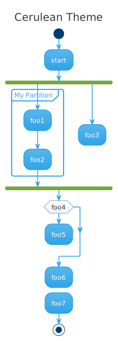
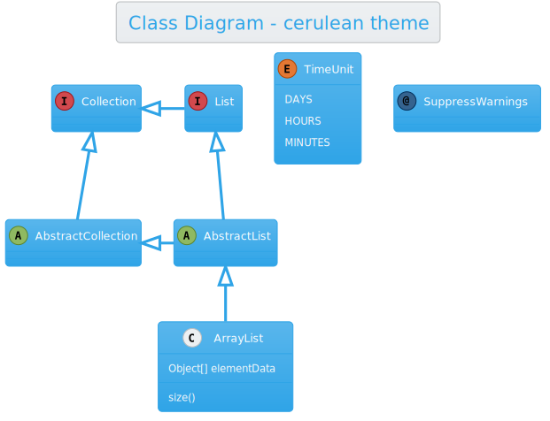
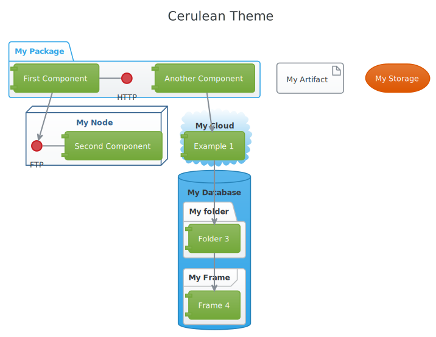
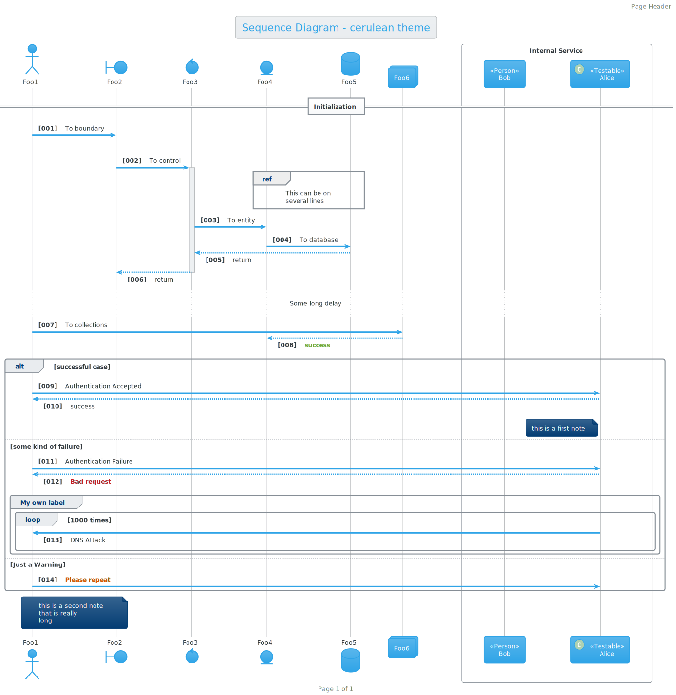
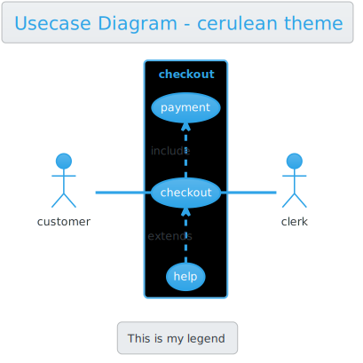
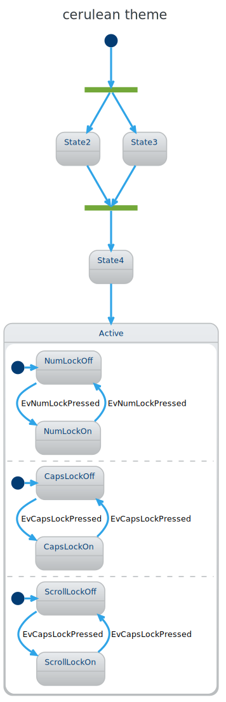
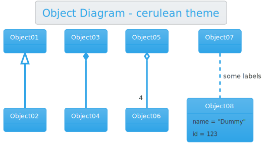

## Usage
Local file
~~~
!include puml-theme-{{ page.title }}.puml
~~~
Remote file
~~~
!include https://raw.githubusercontent.com/bschwarz/puml-themes/master/themes/{{ page.title }}/puml-theme-{{ page.title }}.puml
~~~
or for legacy plantuml
~~~
!includeurl https://raw.githubusercontent.com/bschwarz/puml-themes/master/themes/{{ page.title }}/puml-theme-{{ page.title }}.puml
~~~

<table style="width: 100%">
    <tr>
        <td>
            
        </td>
    </tr>
    <tr>
        <td>
            
        </td>
    </tr>
   <tr>
        <td>
            
        </td> 
    </tr>
    <tr>
        <td>
            
        </td>
    </tr>
   <tr>
        <td>
            
        </td>
    </tr>
    <tr>
        <td>
            
        </td>
    </tr>
    <tr>
        <td>
            
        </td>
    </tr>
</table>
