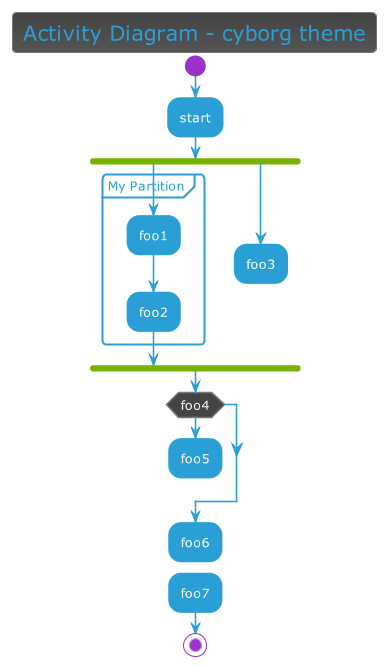
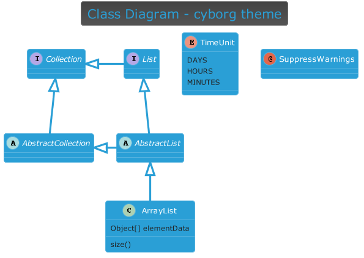
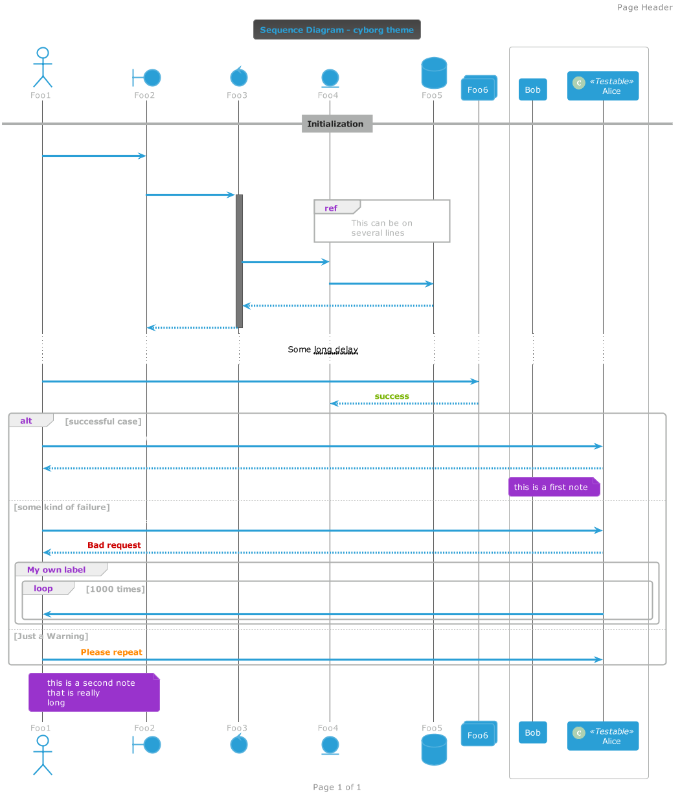
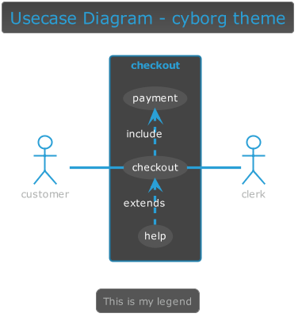
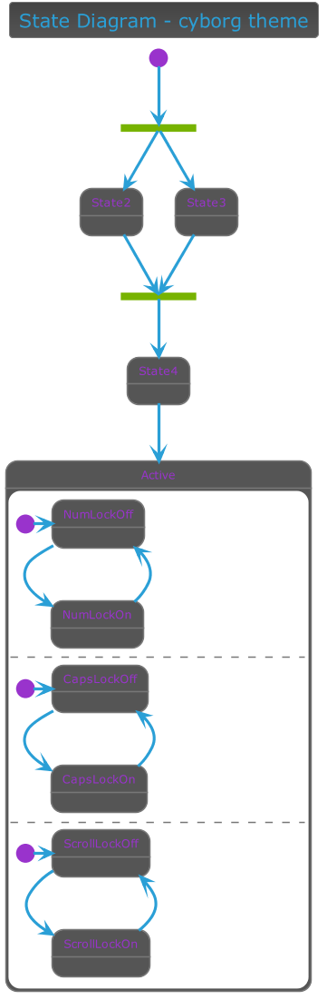
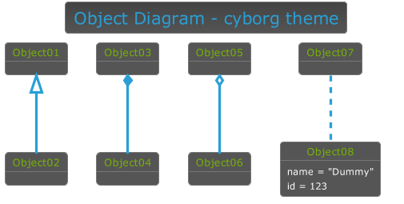

# {{ page.title }}

## Usage

<pre style="font-size: .8rem;">
'Local File
!include puml-theme-{{ page.title }}.puml

'Remote file
!include https://raw.githubusercontent.com/bschwarz/puml-themes/master/themes/{{ page.title }}/puml-theme-{{ page.title }}.puml

'Remote File for legacy plantuml
!includeurl https://raw.githubusercontent.com/bschwarz/puml-themes/master/themes/{{ page.title }}/puml-theme-{{ page.title }}.puml
</pre>

## Gallery
<table style="background: black; width: 100%">
    <tr>
        <td>
            
        </td>
    </tr>
    <tr>
        <td>
            
        </td>
    </tr>
   <tr>
        <td>
            
        </td> 
    </tr>
    <tr>
        <td>
            
        </td>
    </tr>
   <tr>
        <td>
            
        </td>
    </tr>
    <tr>
        <td>
            <!--  -->
        </td>
    </tr>
    <tr>
        <td>
            
        </td>
    </tr>
    <tr>
        <td>
            
        </td>
    </tr>
</table>
