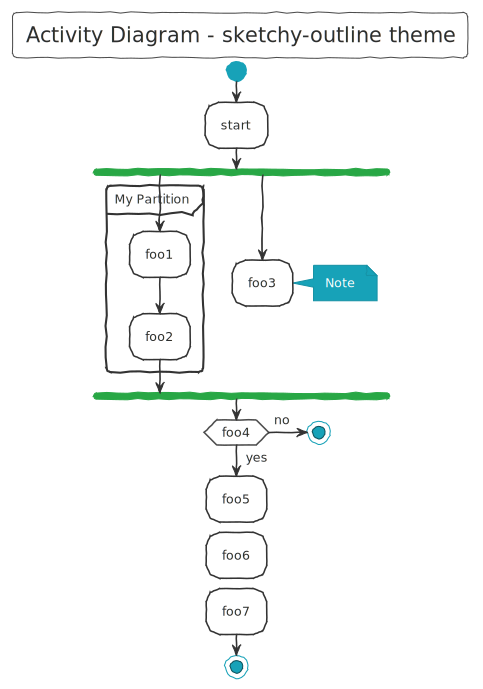
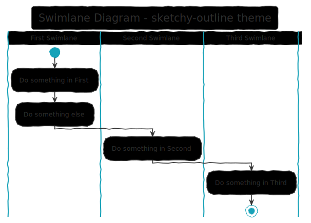
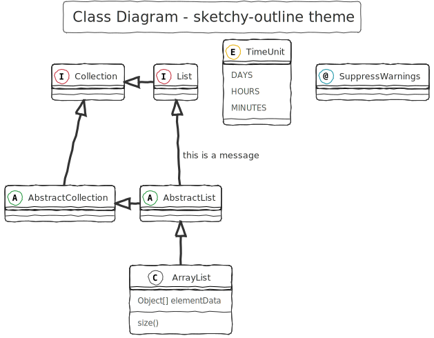
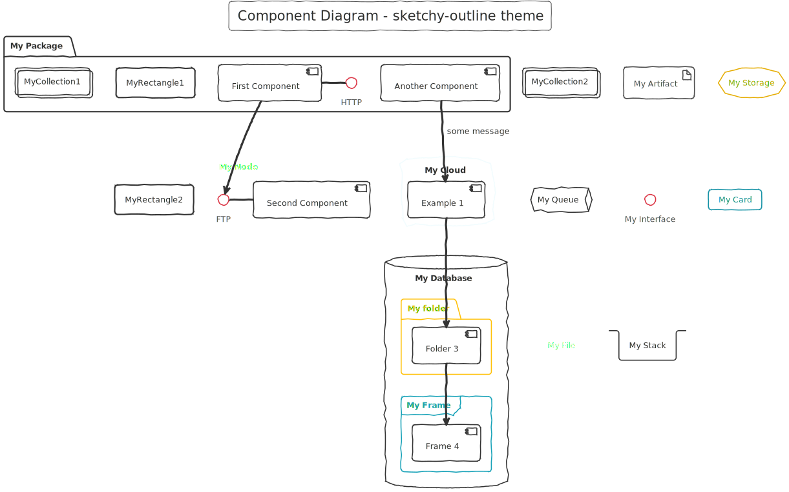
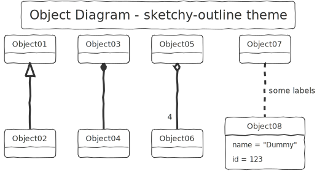
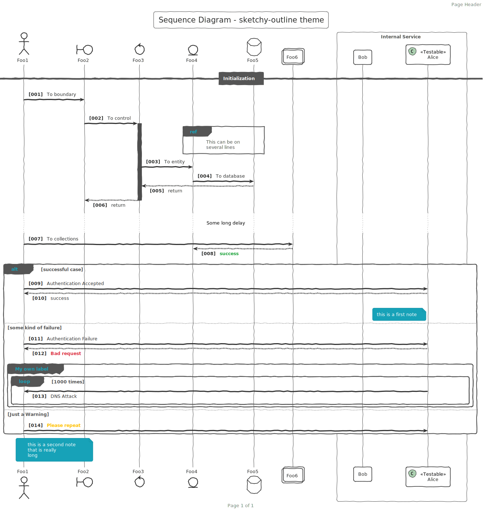
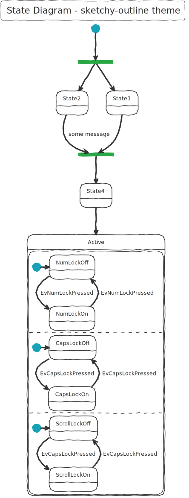
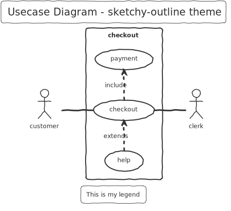

# {{ page.title }}

## Usage

Local File
<pre style="font-size: .8rem;">
!include puml-theme-{{ page.title }}.puml
</pre>

Remote file (for legacy plantuml, use !includeurl)
<pre style="font-size: .8rem;">
!include https://raw.githubusercontent.com/bschwarz/puml-themes/master/themes/{{ page.title }}/puml-theme-{{ page.title }}.puml
</pre>

## Gallery
<table style="background: white; width: 100%">
    <tr>
        <td>
            
        </td>
    </tr>
    <tr>
        <td>
            
        </td>
    </tr>
    <tr>
        <td>
            
        </td>
    </tr>
   <tr>
        <td>
            
        </td> 
    </tr>
    <tr>
        <td>
            
        </td>
    </tr>
    <tr>
        <td>
            
        </td>
    </tr>
    <tr>
        <td>
            
        </td>
    </tr>
    <tr>
        <td>
            
        </td>
    </tr>
</table>
